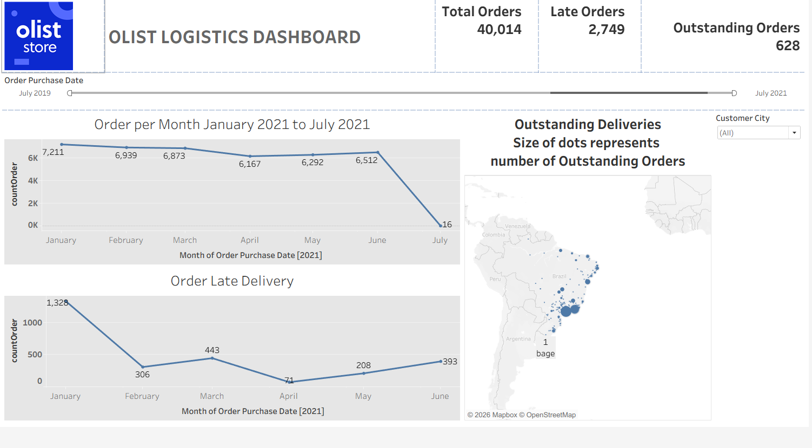

# 🚚 OLIST Logistics Dashboard (Tableau)

📊 An interactive logistics analytics dashboard built using **Tableau**, focused on order trends, late deliveries, and outstanding orders for the OLIST e-commerce dataset.

---

## 📌 Project Overview
This project is part of  OLIST Logistics Dashboard** from a Tableau data analytics course.  
The dashboard analyzes **order volume, delivery delays, and outstanding shipments** to help logistics and operations teams monitor performance and identify bottlenecks.

---

## 🎯 Business Objectives
- Monitor total orders over time  
- Track late and outstanding deliveries  
- Identify cities with high delivery issues  
- Support data-driven logistics decisions  

---

## 🧠 Key Metrics (KPIs)
- **Total Orders**
- **Late Orders**
- **Outstanding Orders**
- **Orders per Month**
- **Late Deliveries Trend**

---

## 📊 Dashboard Insights
- Monthly order volume trends (Jan 2021 – Jul 2021)
- Late delivery patterns across months
- Geographic distribution of outstanding deliveries
- City-level filtering for targeted analysis

---

## 🛠 Tools & Skills Used
- Tableau Desktop  
- Calculated Fields  
- Filters & Parameters  
- Time-series analysis  
- Geographic (Map) visualization  
- Dashboard design & storytelling  

---

## 📸 Dashboard Preview

### Final OLIST Logistics Dashboard

---

## ▶️ How to Use
1. Open the Tableau workbook (`.twb`) in Tableau Desktop  
2. Ensure dataset paths are correctly mapped  
3. Interact with filters (date, customer city)  
4. Explore trends and insights through the dashboard  

---

## 🎓 Learning Outcomes
- Hands-on logistics analytics experience  
- Strong understanding of Tableau dashboards  
- KPI-driven operational analysis  
- Real-world e-commerce use case for portfolio  

---

